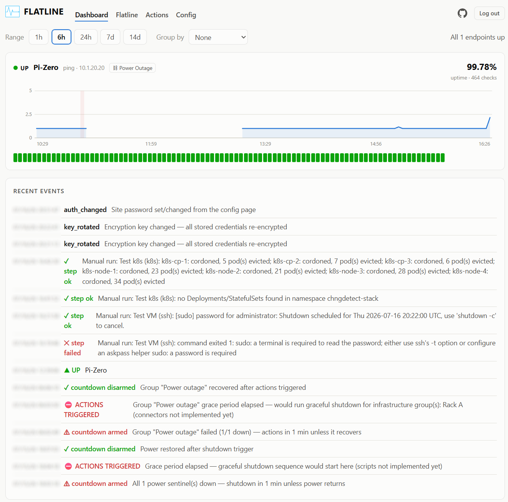
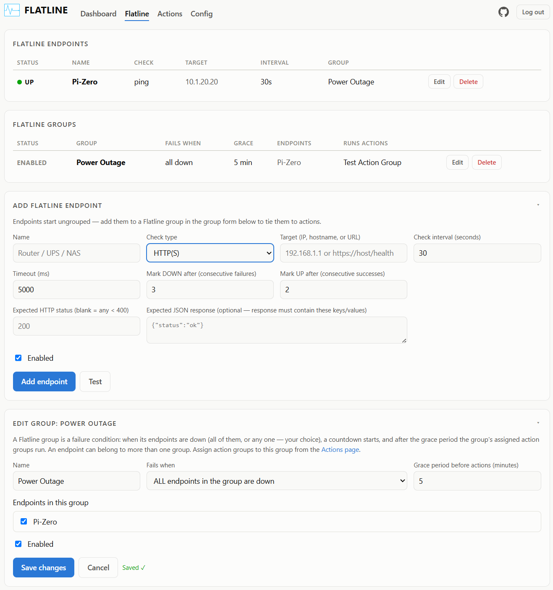
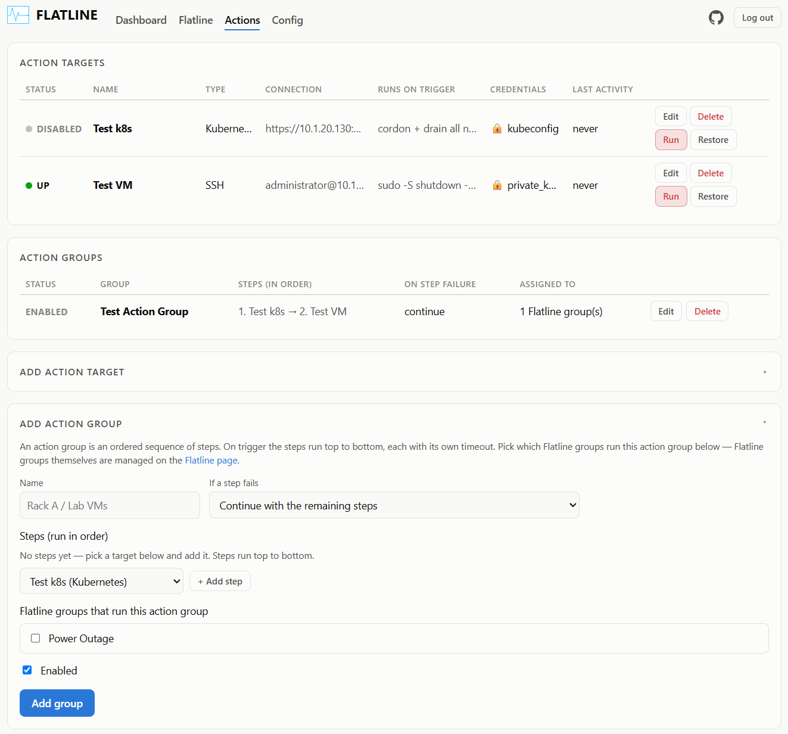

<div align="center">
    
#   Flatline


###

[](LICENSE) [](https://github.com/jagtx459/flatline/commits/main) [](https://github.com/jagtx459/flatline/issues) [](https://github.com/jagtx459/flatline/stargazers) 

    

</div>
A small self-hosted system monitor that pings or probes endpoints for availability with configurable mechanisms to run scripts in your environment. The intended use is for initiating graceful shutdowns or migrations of infrastructure during a power outage to avoid data corruption and loss.  

<div align="center">

****This app is still a work in progress and is intended for homelab and testing environements only, use at your own risk!*** *
</div>

## How it works

1. Each **Flatline Endpoint** is checked on its own interval using ICMP or HTTP(s).
2. An endpoint flips DOWN after N consecutive failures and back UP after M consecutive successes.
3. Endpoints must be placed in a **Flatline Group**. A group fails when failure conditions are met; for example either **all** of them or **any** one, per group.

<div align="center"></div>

4. A failing group will arm a countdown. If it recovers before the group's grace period elapses, it disarms; otherwise the group's assigned **Action Group** will run.
5. **Action Groups** are created from **Action Targets** and run in the order you set. **Action Targets** are targeted infrastructure for running script(s) against to, for example, shutdown or remove workloads in your environment.

<div align="center"></div>

## Notifications

Flatline supports a few, but more in the future releases, notification platforms for event triggers with basic template support for messages.

## Security ***Please Read! *

****Again, Flatline is still a work in progress and intended for homelab use; do NOT expose to the internet!*** *

- **Optional, but recommended login**: set a password on the `/config` page or via `FLATLINE_PASSWORD` (which overides when both are set). 

- **Non-root container**: the image runs as the unprivileged `node` user; only the `iputils` ping binary gets `cap_net_raw` so ICMP checks work without root.

- **Credentials**: Infrastructure credentials  (passwords, SSH keys, tokens, kubeconfigs, webhook URLs) are encrypted at rest with AES-256-GCM and are write-only through the API. The server only reports *which* fields are set, never their values. The key comes from `FLATLINE_SECRET_KEY` (32 bytes as 64 hex chars or base64) or is auto-generated in `<data dir>/secret.key` on first use. **Back that key up**, as without it stored credentials are unrecoverable and must be re-entered. The key can be rotated from the `/config` page: a new key is staged, every encrypted blob is re-encrypted in a single transaction, and the key file is atomically swapped. When the key comes from `FLATLINE_SECRET_KEY`, set the new key manually on the config page and update the environment variable to match before the next restart.

## Run with Docker (recommended)

### Pull the published image

Each release is built, scanned for vulnerabilities, and published to both the GitHub Container Registry and Docker Hub. Pick either:

```sh
# GitHub Container Registry
docker pull ghcr.io/jagtx459/flatline:latest
# or Docker Hub
docker pull jagtx459/flatline:latest

docker run -d --name flatline -p 3131:3131 -v flatline-data:/data \
  --sysctl net.ipv4.ping_group_range="0 2147483647" \
  ghcr.io/jagtx459/flatline:latest
```

Tags available on both registries: `latest`, the release version (e.g. `0.3.0`), and `sha-<commit>`.

### Build from source

```sh
docker compose up -d --build
# or
docker build -t flatline .
docker run -d --name flatline -p 3131:3131 -v flatline-data:/data --sysctl net.ipv4.ping_group_range="0 2147483647" flatline
```

Optional environment variables: 
  - `FLATLINE_PASSWORD` (require a login) 
  - `FLATLINE_SECRET_KEY` (credential encryption key; otherwise auto-generated in `/data`)
  - `FLATLINE_ALLOWED_HOSTS` (extra hostnames allowed in the `Host` header, e.g. `flatline.lan`)
  - `PORT`. 

## Run directly

```sh
npm install
npm start          # http://localhost:3131
```

## AI

This application's development was AI assisted using Claude.ai, contributions are welcome using the templates provided.    
